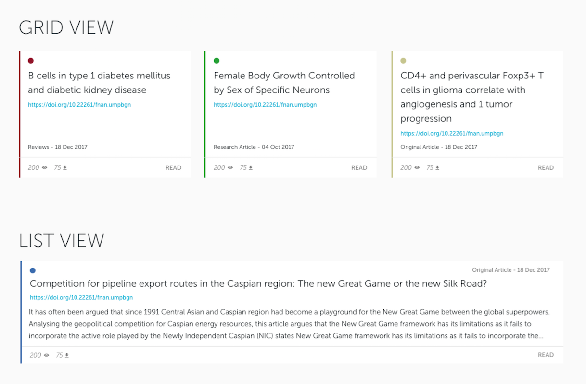

## Article App 

### Project information

This app renders to the screen cards with information about articles, there is a toggle to switch between shorter version and card with small description included (grid/list toggle). Clickthrough on card takes user to the page where full articles is displayed. Article data is taken from JSON feed, article template is in a form of <html> template to be rendered to the screen.

The publications.json was copied over to this app scaffolded with ***create-react-app*** due to time saving need to focus on development not on env setup

### Instruction
- ```git clone``` the project repo
- ```yarn install``` to install all dependencies
- ```yarn start``` to kickstart FE application

### Project requirements

- small web app to present ```publications.json``` feed as a list of publications to browse
- some visual aggregations, nice to have visual effects
- third-party libraries allowed via yarn
- build and optimization tools allowed
- web responsiveness
- use of ECMA6
- documentation
- time limit 2 hours
- React allowed provided that one of the views will not be implemented with it
- write tests with Jest, Mocha, Chai, Sinon and Enzyme

- articles to be shown as cards
- grid format and a list format, toggle to switch between
- both to show the following data:
  - short title
  - DOI
  - article type (aka publicationType)
  - publication date (all datetimes are UTC unless specified)
  - number of views (nView)
  - number of downloads (nDownloads)
  - journal colour (journalId colour does not have to match eg. lightcoral #F08080 to represent RED)
  - only the list format must show the abstract, 
  - text on list format must be truncated to 3 lines
  - BONUS: in grid format, when viewport resized cards could be animated to move to their new position


### Steps completed
- used ***create-react-app** to scaffold application
- used ***node-sass-chokidar*** to transpile Sass to CSS on build, ***watch-css*** to transpile while developing
- visual aggregations/effects?
- third party packages/yarn -> sass-chokidar?
- web responsivness?
- use of ECMA6?
- documented?
- time?
- React, but one view without?
- tests?
- articles as cards
- toggle between grid and list
- render data on cards

### To do / ideas
- tbc

### Screenshot

The [***live version of the below is available here***](https://google.com/) deployed to Heroku 

Requested final output
